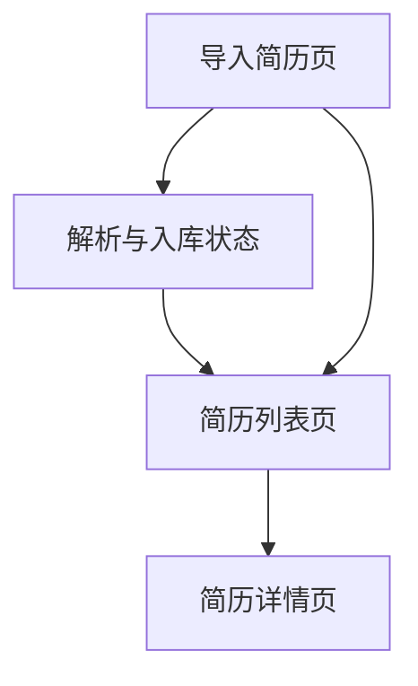

## 1. Product Overview
简历库用于将简历文件通过“手动上传”或“输入文件链接”导入，并自动解析关键信息后结构化存储，便于集中检索与查看。
面向需要批量整理候选人简历的招聘/用人团队或个人。

## 2. Core Features

### 2.1 Feature Module
我们的简历库需求由以下核心页面构成：
1. **导入简历页**：上传文件/输入链接导入、导入任务状态与错误提示。
2. **简历列表页**：结构化字段列表展示、搜索与筛选、导入结果快速定位。
3. **简历详情页**：字段详情展示、原始语言自我介绍摘要查看、数据存储结果确认。

### 2.2 Page Details
| Page Name | Module Name | Feature description |
|-----------|-------------|---------------------|
| 导入简历页 | 导入方式选择 | 选择“手动上传文件”或“输入文件链接”作为导入来源。 |
| 导入简历页 | 手动上传导入 | 上传简历文件并提交导入；显示上传进度与结果提示。 |
| 导入简历页 | 链接导入 | 输入文件链接并提交导入；对链接格式进行基础校验并提示错误。 |
| 导入简历页 | 解析与入库状态 | 展示导入任务状态（进行中/成功/失败）；失败时展示原因与可重试操作。 |
| 简历列表页 | 列表展示 | 按条目展示解析并存储的简历信息摘要：姓名、国家/城市、工作年限、联系方式概览、导入时间。 |
| 简历列表页 | 搜索与筛选 | 基于已存储字段进行检索与筛选（如姓名、国家/城市、工作年限范围）。 |
| 简历列表页 | 跳转查看 | 从列表进入简历详情页查看完整解析结果。 |
| 简历详情页 | 结构化字段展示 | 展示并分组呈现：姓名、国家/城市、联系方式、工作年限、教育经历。 |
| 简历详情页 | 自我介绍摘要（原语言） | 展示解析出的自我介绍摘要，并保持原语言不翻译。 |
| 简历详情页 | 来源信息 | 展示导入来源（上传/链接）、原文件链接或存储引用（用于追溯）。 |

## 3. Core Process
**导入与解析流程（统一）**：
你在导入简历页选择导入方式 → 提交文件或链接 → 系统解析简历内容并抽取字段（姓名、国家城市、联系方式、工作年限、教育经历、自我介绍摘要原语言）→ 将结构化结果写入简历库 → 你在列表页检索/筛选并进入详情页查看。

