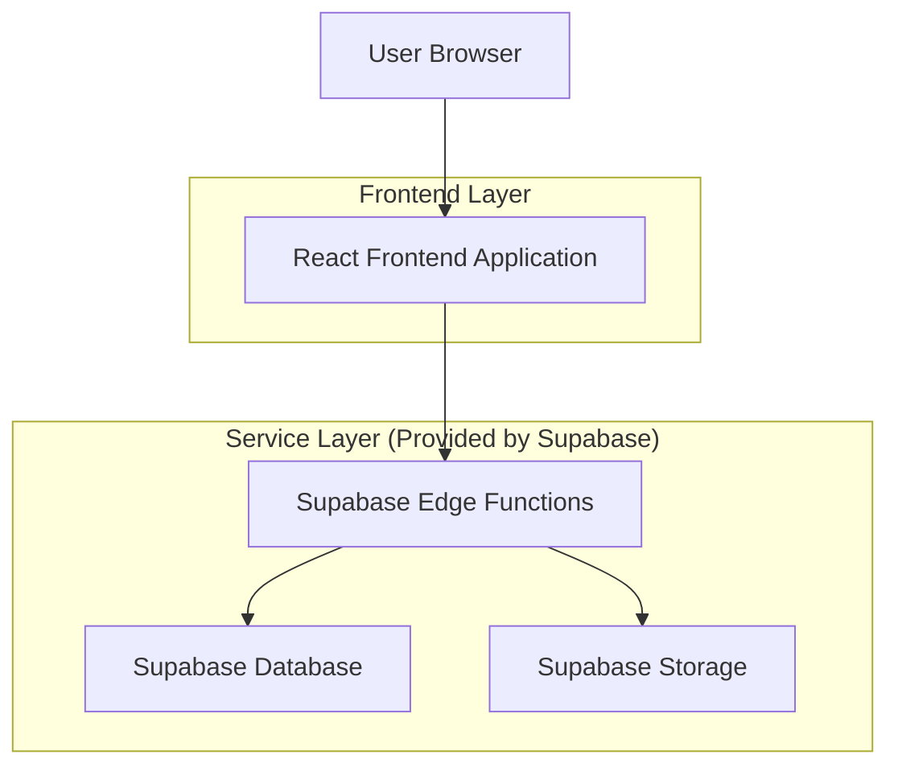
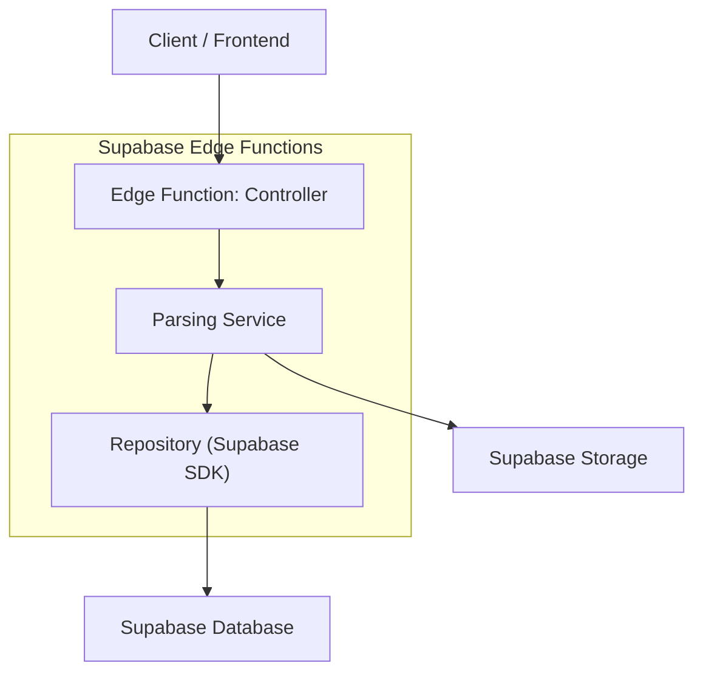
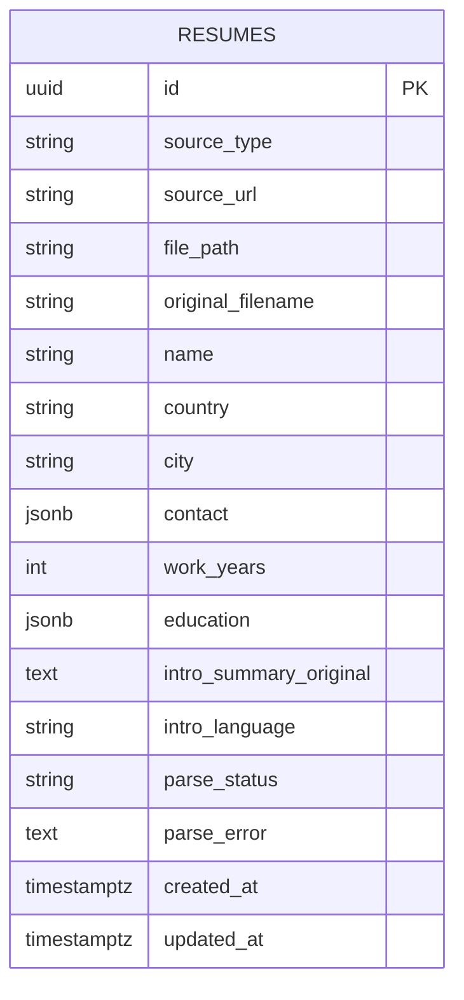

## 1.Architecture design



## 2.Technology Description
- Frontend: React@18 + TypeScript + vite + tailwindcss@3
- Backend: Supabase（Edge Functions + Auth(可选)）
- Database: Supabase Postgres
- File Storage: Supabase Storage

## 3.Route definitions
| Route | Purpose |
|-------|---------|
| /import | 导入简历：上传文件或输入链接提交导入任务，并查看解析状态 |
| /resumes | 简历列表：展示已入库简历，支持搜索与筛选 |
| /resumes/:id | 简历详情：查看结构化字段与自我介绍摘要（原语言） |

## 4.API definitions (If it includes backend services)

### 4.1 Core API
解析与入库（上传文件或链接均走同一入口）
```
POST /functions/v1/parse_resume
```

Request:
| Param Name| Param Type  | isRequired  | Description |
|-----------|-------------|-------------|-------------|
| sourceType | 'upload' \| 'url' | true | 导入来源类型 |
| storagePath | string | false | sourceType=upload 时，文件在 Storage 的路径 |
| fileUrl | string | false | sourceType=url 时，文件直链 |
| originalFilename | string | false | 原始文件名（用于展示/追溯） |

Response:
| Param Name| Param Type  | Description |
|-----------|-------------|-------------|
| resumeId | string | 入库后的简历记录 ID |
| status | 'success' \| 'failed' | 解析结果 |
| errorMessage | string | 失败原因（失败时返回） |

TypeScript（前后端共享）
```ts
export type SourceType = 'upload' | 'url'

export type EducationItem = {
  school?: string
  degree?: string
  major?: string
  startDate?: string
  endDate?: string
}

export type ResumeRecord = {
  id: string
  source_type: SourceType
  source_url?: string | null
  file_path?: string | null
  original_filename?: string | null

  name?: string | null
  country?: string | null
  city?: string | null
  contact?: {
    phone?: string
    email?: string
    linkedin?: string
    github?: string
    website?: string
    other?: string[]
  } | null
  work_years?: number | null
  education?: EducationItem[] | null
  intro_summary_original?: string | null
  intro_language?: string | null

  parse_status: 'processing' | 'success' | 'failed'
  parse_error?: string | null

  created_at: string
  updated_at: string
}
```

## 5.Server architecture diagram (If it includes backend services)


## 6.Data model(if applicable)

### 6.1 Data model definition


### 6.2 Data Definition Language
Resumes Table (resumes)
```
CREATE TABLE resumes (
  id UUID PRIMARY KEY DEFAULT gen_random_uuid(),

  source_type VARCHAR(10) NOT NULL CHECK (source_type IN ('upload','url')),
  source_url TEXT NULL,
  file_path TEXT NULL,
  original_filename TEXT NULL,

  name TEXT NULL,
  country TEXT NULL,
  city TEXT NULL,
  contact JSONB NULL,
  work_years INTEGER NULL,
  education JSONB NULL,
  intro_summary_original TEXT NULL,
  intro_language TEXT NULL,

  parse_status VARCHAR(12) NOT NULL DEFAULT 'processing' CHECK (parse_status IN ('processing','success','failed')),
  parse_error TEXT NULL,

  created_at TIMESTAMPTZ NOT NULL DEFAULT NOW(),
  updated_at TIMESTAMPTZ NOT NULL DEFAULT NOW()
);

CREATE INDEX idx_resumes_created_at ON resumes(created_at DESC);
CREATE INDEX idx_resumes_name ON resumes(name);
CREATE INDEX idx_resumes_country_city ON resumes(country, city);
CREATE INDEX idx_resumes_work_years ON resumes(work_years);

-- Permissions (baseline; production 建议结合 RLS 与 Auth 做访问控制)
GRANT SELECT ON resumes TO anon;
GRANT ALL PRIVILEGES ON resumes TO authenticated;
```
